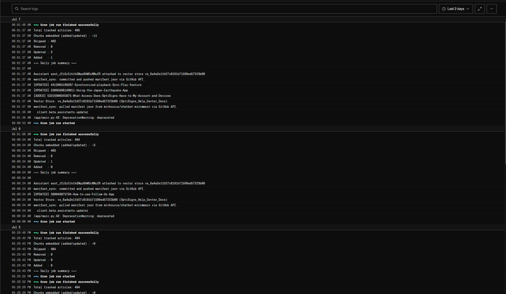
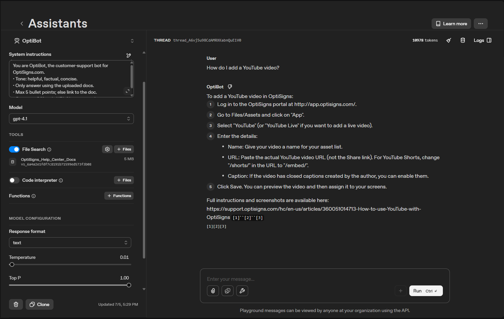

# chatbot-mini — OptiBot RAG Support Assistant

RAG-based support chatbot cloning OptiSigns' OptiBot, built on OpenAI Assistants API + Vector Store (`file_search`). Scrapes `support.optisigns.com`'s Zendesk Help Center, converts to Markdown, embeds into a Vector Store, and re-syncs daily via a delta-detection job.

## Setup

```bash
git clone <this-repo>
cd chatbot-mini
pip install -r requirements.txt
cp .env.sample .env   # fill in real values below
```

`.env` variables:

| Variable | Required | Purpose |
|---|---|---|
| `OPENAI_API_KEY` | Yes | OpenAI API access |
| `OPENAI_ASSISTANT_ID` | Yes | Assistant to attach the Vector Store to |
| `GITHUB_TOKEN` | Only for the daily job | Classic PAT with repo scope — lets `manifest_sync.py` persist `manifest.json` across runs on ephemeral hosts (Render/Railway/etc. wipe the filesystem between runs) |

## Run locally

```bash
# One-off full scrape + upload (creates the Vector Store if it doesn't exist)
python scraper.py
python upload_vector.py

# Daily delta job (what runs in production) - pulls manifest.json,
# re-scrapes, uploads only new/changed articles, pushes manifest.json back
python main.py
```

Without `GITHUB_TOKEN` set, `main.py` runs but can't persist `manifest.json` remotely — each local run is treated as a fresh/cold start. That's fine for local testing; production runs need `GITHUB_TOKEN` configured.

## Architecture

```
scraper.py        -> fetch_all_articles() [Zendesk API, paginated, retry/backoff]
                   -> convert_article_to_markdown() [HTML->MD, inject "Article URL:" markers]
upload_vector.py  -> get_or_create_vector_store(), upload_single_file(), delete_file()
manifest_sync.py  -> pull/push manifest.json via GitHub Contents API (survives ephemeral hosts)
main.py           -> orchestrates: diff against manifest.json -> upload only the delta
```

## Chunking strategy

**Static chunking**: `max_chunk_size_tokens=400`, `chunk_overlap_tokens=120`.

- Support articles are short-to-medium; 400 tokens keeps each chunk close to one idea/section without mixing unrelated topics.
- Every article gets an `Article URL: <url>` line injected every 280 tokens (`= max_chunk_size - overlap`, using the same `tiktoken` encoding OpenAI uses), so **every chunk carries its own citation**, regardless of where the chunk boundary falls or whether the article uses real headings.
- Chunk count is logged per run (`upload_vector.py` / `main.py` print `Chunks embedded: ~N`, computed locally via the same sliding-window math before upload).

## Daily job

- Runs once/day on **Render Cron Job** at 23:00 PM UTC (06:00 AM UTC +7). Re-scrapes, diffs each article's `updated_at` against `manifest.json`, and only uploads/deletes what changed.
- Log output per run: `Added / Updated / Removed / Skipped` counts.
- **Job logs**: 

## Sample question & citations

Asked: *"How do I add a YouTube video?"*


